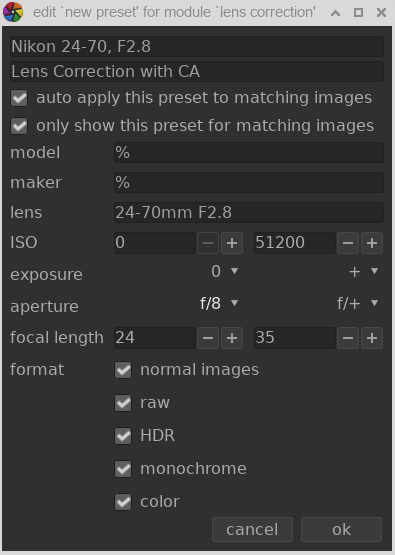

Presets allow you to store commonly used module settings for future use. Some modules already come with pre-defined presets and you may also define your own. Both internal and user-defined presets can be shown by clicking the _presets menu_ in the [module header](./module-header.md).

# the presets menu

The presets menu will contain one or more of the following entries depending on what presets are defined or selected for the current module:

preset list
: A list of the presets available for the current module. The currently selected preset (if any) is shown in **bold**.

edit this preset
: If a preset has been selected, click to edit that preset (see below)

delete this preset
: If a preset has been selected, delete that preset.

update preset \[name\]
: Update the named preset to match the module's current parameters.

store new preset
: Create a new preset using the module's current parameters.

`Middle-click` on a preset name to create a new instance of the module and apply the selected preset to it.

# creating and editing presets

When creating or editing presets, the following dialog is shown:

The following options can be set:

name
: The name of the preset

description
: A searchable description for the preset (optional)

auto apply this preset to matching images
: Check this box to automatically apply this preset to matching images when they are opened in the darkroom for the first time. Additional controls will appear to allow you to define which images the preset will be applied to based on image Exif data.

: For example, if you want a preset to be applied to all images from a specific camera leave all fields at default values except for the model field. Leave all fields unchanged to auto-apply a preset to all images.

: The example dialog above sets up following rules: if the lens name matches, the aperture is greater than or equal to f/8 and the focal length is between 24 and 35mm the preset will be automatically applied. 

: _Tip: The image [image information](../../module-reference/utility-modules/shared/image-information.md) for your image displays your model name. Use this to ensure you have the correct spelling._

only show this preset for matching images
: Check this box to automatically show the preset in the preset menu, using the same set of filters as above.

If you create a preset with the same name as a built-in preset, your newly created preset will override the built-in preset, which will be no longer accessible.

# managing presets

Both user-created and pre-defined presets can be viewed and managed from within [`preferences` -> `presets`](../../../preferences-settings/presets.md).

If you delete a preset that has the same name as one of the built-in presets, then your user preset will be deleted, and that preset name will no longer appear in the preset menu at all. The next time you start darktable, the corresponding built-in preset will once again become visible.

