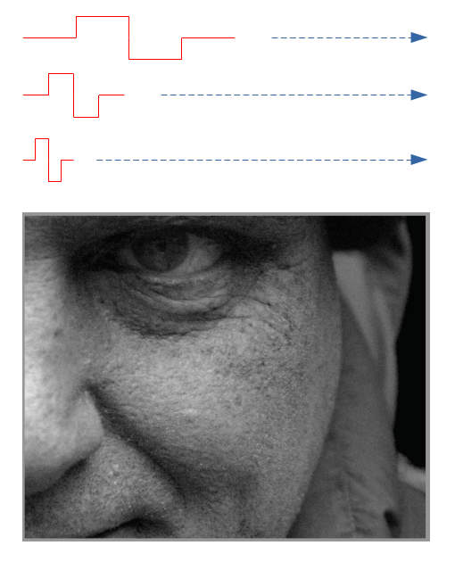
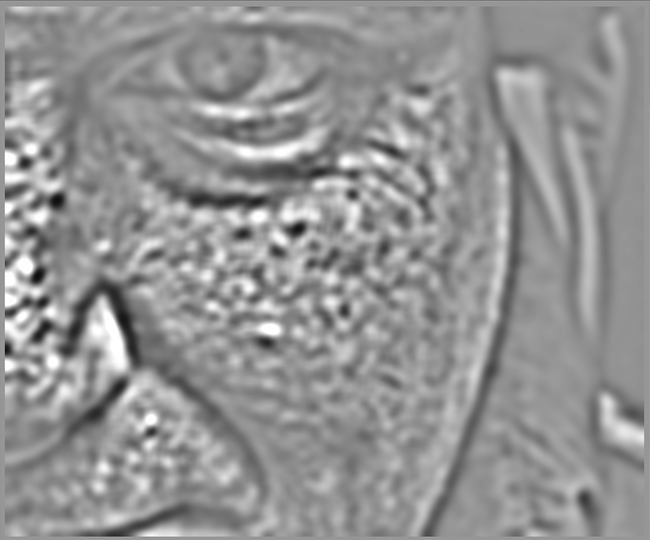
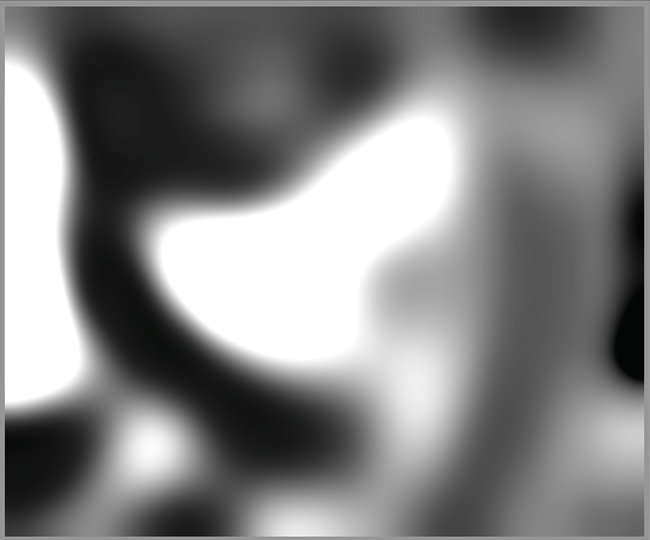
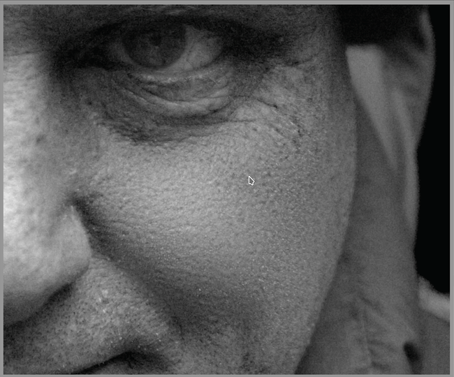

Wavelets are a technique we can use in image processing to decompose an image into different levels of detail, known as _layers_, then we can apply the image processing to one or more layers, and put the picture back together again. This allows us to be surgical about which features in the image we wish to impact. Some of the operations we might perform on the separate layers before sticking them together might be:

- remove noise (like in the [_denoise (profiled)_](../../module-reference/processing-modules/denoise-profiled.md) and [_contrast equalizer_](../../module-reference/processing-modules/contrast-equalizer.md) modules) 
- adjust local contrast (like in the [_contrast equalizer_](../../module-reference/processing-modules/contrast-equalizer.md) module)
- blur unwanted detail (like in the [_retouch_](../../module-reference/processing-modules/retouch.md) module)
- lossy compression (like when we save _JPEG2000_ images using the [_export_](../../module-reference/processing-modules/export-selected.md) module)

# theory

So, what is a wavelet, and how does it work?

A wavelet is a mathematical function that starts off at zero, oscillates up and down and then settles back to zero. The following diagram shows some simple wavelets of different sizes.

 

The wavelet functions are used to scan across and down the image using a mathematical operation called _convolution_. This picks out details from the image that are on a similar scale to the size of the wavelet, and from that we build different layers of detail corresponding to the different sizes wavelets.

Below are some examples of some layers where the details at various scales have been extracted out of the image shown in the first diagram. They were obtained by using the layer visualisation tool in the [_retouch_](../../module-reference/processing-modules/retouch.md) module):

The bar graph in the _wavelets decompose_ section indicates the various layers that have been extracted at different wavelet scales. The darkest rectangle at the left represents the entire composed image, if you drag the bottom triange across to the right it draws a lighter rectange for each wavelet scale. In this example, the image is being decomposed into 8 different scales of detail. The light rectangle which has the red box inside represents a layer atscale = 5, and the red box is indicating that I have created a mask at that scale to introduce some blurring in that specific layer. Clicking on the staircase icon below the bar graph enables the layer visualisation so that you can see what the currently selected layer looks like. So, let's take a look at some of those layers.

At scale #2, we can see in the image below just the very fine detail, which includes eyebrows, eye lashes and pores of the skin. It doesn't include the coarser details of the image, because those coarse details are covered by other layers.

At scale #5 and #6, we can see in the two images below that the detail becomes less about the pores of the skin, and more about the blotchiness of the skin. 

At scale #8, in the image below we are only seeing very high-level features such as the nose, the eye and the cheek.

# application: smooth out blotchy skin

So, let's say we wanted to smooth out blotches on the skin of our model. Here is the full size original image:

A first naïve attempt at smoothing the skin might be to apply a blur on the image to cover up the ugly detail. Here is an example where a patch guassian blur has been applied to the cheek, blended with the original image in a 50-50 ratio:

You can see it has smoothed out the skin a bit, but it has made a bit of a mess and doesn't look too natural, and some effort would be needed to make it look better.

Now let's see what we can do with wavelets. As mentioned before, the layers at scale 5 & 6 were covering the skin blotches without picking up the pores so much, so let's try applying the same shape of guassian blur patch to layers 5 & 6 only, and then put the picture back together. This is the result:

You can see this gives a much more natural result, and it has cleaned up the coarse skin blotches while retaining the fine detail of the pores in the skin. Note that this example is not meant to be a lesson in how to do (or perhaps how not to do) retouching; it is just a very rough exaggerated example attempting to illustrate the principles behind what wavelets are doing and how they can be helpful in image processing.)

# application: selective sharpening

Another application is selectively applying contrast to an image. Suppose we have the following original image:

The eye and the feathers of the bird are not all that sharp, so we decide to add some local contrast to make it appear sharper, using the [_local contrast_](../../module-reference/processing-modules/local-contrast.md) module, which operates in the spatial domain. We might get a picture like this:

You can see that it has sharpened the bird, but it has also increased the contrast of the rocks in the backgroud, which now distracts from the bird which is supposed to be the subject of the photo.

The feathers of the bird represent a fine level of detail, whereas the blurry rocks in the background are a larger coarser structure. Since wavelets allow us to isolate and process separately different levels of detail in an image, let's see if we can sharpen the image of the bird without affecting the background. The [_contrast equalizer_](../../module-reference/processing-modules/contrast-equalizer.md) module allows us to adjust the contrast at different scales in the image. Here is the main spline control for the _contrast equalizer_:

The contrast equalizer has 3 tabs: one for luma (which lets us selectively adjust contrast in brightness), one for chroma (which lets us selectively adjust color saturation) and one for edges (which is used to help rein in halo effects and other artifacts that can result from adjustments on the previous two tabs). 

For sharpening, we want the luma tab. There is a white curve across the middle of the graph with a number of control points you can push up or down. The circle near the mouse pointer shows how much moving one control point will affect the control points on either side -- use the mouse wheel to make the circle bigger to affect more control points, or smaller to focus on moving just the one control point. You can also shift the control points left or right by dragging the triangles at the bottom of the graph.

Pushing up the graph on the "coarser" end will affect the wavelet layers corresponding to big structures in the image; pushing up the graph on the right hand side will increase the contrast amongst the finer detail. There is also a second hidden curve along the bottom of the graph -- you can push it up by placing the mouse just above the triangle markers, and this will help to smooth out any noise at that wavelet scale.

So, for our bird image, let's push up the graph of the contrast equalizer at the "fine detail" end on the right, and also push up the darker denoise curve at the bottom just a bit. We get the following image:

You can see indeed that the fine details of the feathers and the eye have been sharpened, but there is almost no impact to the contrast with the coarser structure of the rocks in the background.

One useful trick when using modules like _contrast equalizer_ that support wavelets -- you can get some clearer idea of what effect the module is having and which levels of detail it is impacting by selecting the uniform mask at the bottom of the module and then choosing the "difference" [blend mode](../masking-and-blending/blend-modes.md) -- this will show you what is the difference between the input and output of the module, and help you to better understand what effect it is having at which levels of detail.

