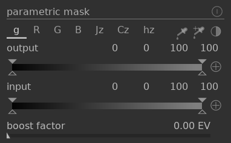
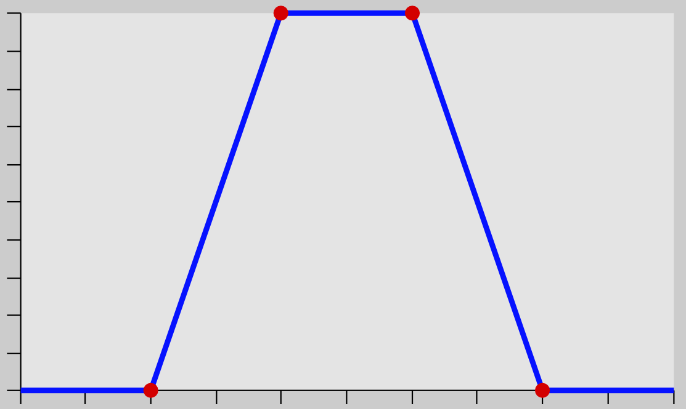
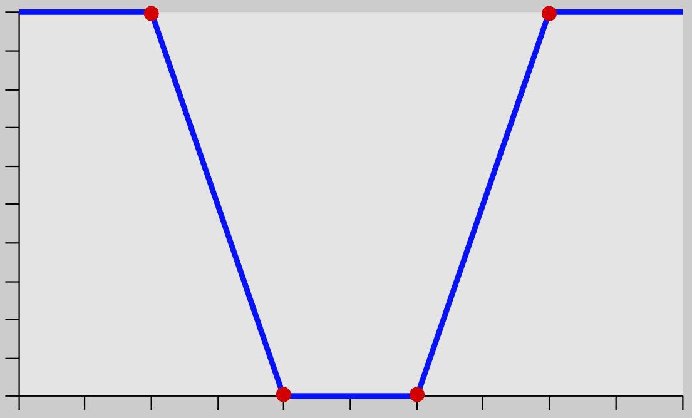

The parametric mask feature offers fine-grained selective control over how individual pixels are masked. It does this by automatically generating an intermediate blend mask from user-defined parameters. These parameters are color coordinates rather than the geometrical coordinates used in drawn masks.

For each data channel of a module (Lab, RGB) and several virtual data channels (e.g. hue, saturation) you  can construct a per-channel opacity function. Depending on each pixel's value for a given data channel this function calculates a blending factor between 0 and 1 (100%) for that pixel.

Each pixel of an image thus has different blending factors for each of its data channels. All blending factors are finally multiplied together (pixel-by-pixel), along with the value of the global opacity slider, to form a complete parametric blend mask for the image.

If the blend mask has a value of 0 for a given pixel, the input of the module is left unchanged. If the blend mask has a value of 1 (100%) for a pixel, the module has its full effect.

# channel tabs

Click on one of the channel tabs to select a data channel to use to build your mask.

Modules acting in _Lab_ color space have data channels for L, a, b, C (chroma of LCh) and h (hue of LCh). 

Modules acting in _RGB_ color space have data channels for g (gray), R, G, B, H (hue of HSL), S (saturation of HSL), and L (lightness of HSL). 

_See [Wikipedia](https://en.wikipedia.org/wiki/Color_space) for more details about these color spaces._

Each data channel provides two sliders for the associated data channel: one that works on the _input data_ that the module receives and one that works on the _output data_ that the module produces prior to blending.

## inspecting data channels & masks

Press the letter `C` while hovering over a channel's input/output slider to view the input/output image data for that color channel. The center image changes to display that color channel either in graycale values or in false colors depending on the setting in [`preferences` -> `darkroom` -> `display of individual color channels`](../../../preferences-settings/darkroom.md). 

Press the letter `M` to see the resulting mask for that slider overlaid on the image. 

When the mouse pointer leaves the slider the image returns to normal after a short delay. 

## linear / log mode

Press the letter `A` while hovering over the a slider to change its display to 'log' mode. This provides more fine control in the shadows. Press `A` again to toggle back to 'linear' mode.

# channel input/output sliders

With each color channel slider you can construct a trapezoidal opacity function. For this purpose there are four markers per slider. Two filled triangles above the slider mark the range of values where opacity is 1. Two open triangles below the slider mark the range values where opacity is zero. Intermediate points between full and zero are given a proportional opacity.

The filled triangles, or inside markers, indicate the closed (mostly narrower) edge of the trapezoidal function. The open triangles, or outside markers, indicate the open (mostly wider) edge of the trapezoidal function. The sequence of the markers always remains unchanged: they can touch one another but they cannot switch position.

A polarity (+/-) button to the right of each the slider switches between "range select" and "range de-select" function modes with visual confirmation provided by exchanging the upper and lower triangle markers. These two types of trapezoidal functions are represented graphically in the following images. 

**range select**

**range deselect**

In their default state all markers are at their extreme positions. In this state a range select function selects the whole range of values giving an “all at 100%” mask. Starting from there one can move the sliders inwards to gradually exclude more and more parts of the image except for the remaining narrow range.

Conversely a range de-select function (enabled by toggling the polarity) by default deselects the whole range of values, giving an “all-zero” mask as a starting point. Moving the sliders inwards gradually includes more and more parts of the image except for the remaining narrow range. 

# color pickers

With the left-hand color picker button you can select a point or area probe from your image. The corresponding values for the real and virtual data channels are then displayed within each color channel slider.

With the right-hand color picker button you can automatically set the slider's values based on the selected range. `Click` and drag to set the parameters for the input slider from the drawn rectangle; `Ctrl+click` and drag to set the parameters for the output slider.

# invert

Click the invert button above the sliders to invert the polarity of the entire parametric mask. This differs from the polarity buttons beside the individual sliders which just invert the parameters for the current slider/channel.

# reset

Click the reset button above the sliders to revert all parametric mask parameters to their default state.

