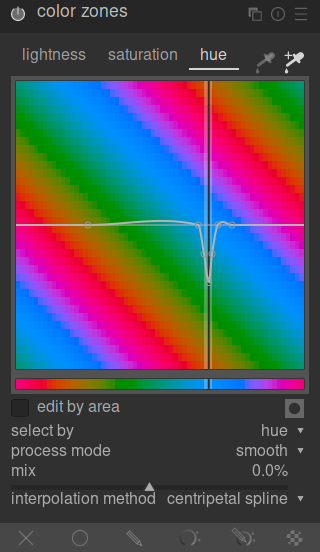

This module works in LCh color space, which breaks pixels down into _lightness_, _chroma (or saturtation) and hue components. You choose whether you want to select pixels on the basis of their lightness, hue or saturation attribute, then you can adjust all pixels matching a particular value of that input attribute by draging the lightness, saturation and/or hue curves on the different tabs in _color zones_. This provides a lot of flexibility, and it means you can do things like the following:

- based on the hue of the incoming pixels, you might want to reduce the saturation of the pixels going out (eg. you could desaturate just the reds in your image).
- based on the hue of the incoming pixels, you might want to shift the outgoing hue a bit (eg. if your skin tones look a bit green, ou could shift their hue to become more organge).
- based on the lightness of the incoming pixels, you might want to adjust their saturation (eg. add some more saturation to your shadows).

# module controls

The horizontal axis represents the ranges of pixels you want to adjust, and can be based in lightness, saturation or hue. The vertical axis indicates by how much the pixels should be adjusted, in terms of their lightness, saturation or hue.

The spline curve alows you to place control points to move the curve and set the amount of adjustment to be applied to the pixels that match the attribute shown on the horizontal axis. To add a control point, `click` on the curve and `drag` it to place the control point. You can change how the shape of the curve between the control points is calculated using the _interpolation method_ setting described below.

Sometimes it is useful to pick out a specific pixel in the image and see where it falls on the horizontal axis, so that you know where on the graph to make you adjustment. Using the first eyedropper will draw a dark vertical line on the graph to indicate where the selected pixel falls on the horizontal axis.

You can also select a range of pixels using the second eyedropper (the one with a plus `+` sign). If you `Drag` out a region on the image, the range of selected pixels are shown by the white highlight on the graph, and control points are added at the extremes and the middle of the ragne to allow you to easily move the curve up or down within that range. If you use a `Ctrl+Drag`, instead of getting a flat curve within the selected region, you'll get a curve that is already raised within the selcted region. If you use a `Shift+Drag`, you'll get a curve that has us already lowered within the selected region.

tabbed controls
: The module provides tabs with a curve for each of the three channels “lightness”, “saturation”, and “hue”, so that you can adjust these attributes individually based on the pixel selection criterion.

edit by area
: Control the interaction mode with the curve. This setting is disabled by default, which allows the control points for the curve to be freely placed and dragged. By enabling this setting, the adjustment of the curve falls back to a legacy mode, working in a similar to the spline curve controls used in the [wavelets](../../darkroom/interacting-with-modules/wavelets.md) modules.

mask display
: By enabling the _mask display_ icon, any pixels that have been affected by _color zones_ adjustments will be highlighted in yellow.

select by
: Defines the horizontal axis, i.e. the range of values you work on. You can choose between “lightness”, “saturation”, and “hue” (default). Changing this parameter resets any defined curve to a straight horizontal line. If you want to work on moultiple ranges, you'll need multiple instances of the _color zones_ module.

process mode
: Choose between a “smooth” (default) or “strong” processing mode which alter the final effect.

mix
: Use this parameter to tune the strength of the overall effect.

interpolation method
: The interpolation is the strategy used to draw a continuous curve through a set of control points. There are multiple ways to choose a smooth curve that joins up a set of points, and some methods work better than others in certain situations.

Possible interpolation methods are:

- the _cubic spline_: arguably, this gives the most visually pleasing results, since it gives smooth curves and therefore a nicer the contrast in the image. However, this method is very sensitive to the nodes position, and can produce cusps and oscillations when the nodes are too close to each other, or when there are too many of them. This method works best when there are only 4 to 5 nodes, evenly spaced.

- the _centripetal spline_ is a method designed specifically to avoid cusps and oscillations, but as a drawback it will follow the nodes more loosely. It is very robust, no matter the number of nodes and their spacing, but will produce a more faded and dull contrast. Because this spline is the most well-bahaved, it is chosen as the default for this module.

- the _monotonic spline_ is a method designed specifically to give a monotonic interpolation, meaning that there will be none of the oscillations the cubic spline may produce. This method is very suitable when you try to build an analytical function from a node interpolation (for example: exponential, logarithm, power, etc.). Such functions are provided as presets. It is a good trade-off between the two aforementioned methods.

