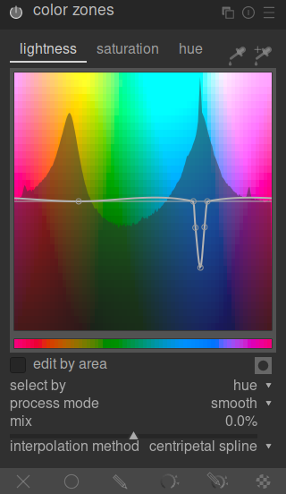
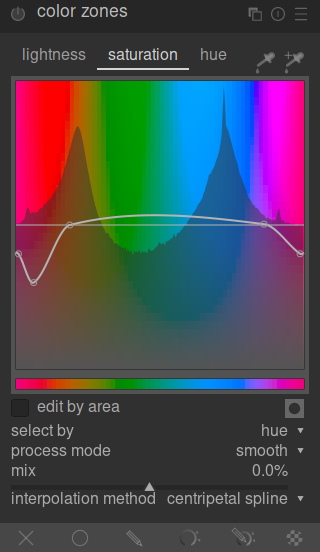
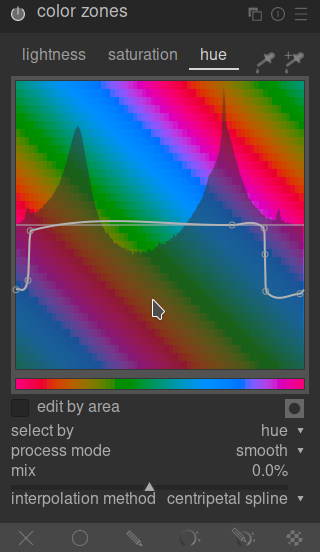

This module works in CIE LCh color space, which breaks pixels down into _lightness_, _chroma (or saturation) and hue components. It allows you to manipulate the lightness, hue and saturation of certain targeted groups of pixels through the use of [_curves_](../../darkroom/interacting-with-modules/curves.md).

The _color zones_ module has three main modes, depending on how you want to single out the different groups of pixels that you want to adjust. One you have chosen the pixel selection criterion, you can then use the three curves on their respective tabs to adjust the hue, lightness and saturation of different ranges of pixels.

# pixel selection criteria

The _color zones_ module offers three different modes for choosing which pixels you want to adjust. They are:

select by hue mode
: This allows you choose which pixels to target based on their color hue. For example, you may want to darken a blue sky, or change a red porche into a yellow one. The following picture shows the full range of hues that you can choose to operate on:
: 

select by lightness mode
: This allows you to choose which pixels to manipulate based on their lightness. Maybe you want to make your shadows brighter (which is like doing a sort of tone mapping), or maybe you want to make your highlights a little more of a yellow hue. The following diagram shows the range of lightness levels that you can choose to work on, from dark to light:
: 

select by saturation mode
: This allows you to choose which pixels to manipulate based on their saturation. Maybe you want to tone down the saturation of some already highly saturation pixels, or maybe you want to change theur hue. The following diagram shows the range of saturation levels that you can choose to work on, from a completely unsaturated monochrome grey through to the most brightly saturated color:
: 

# pixel manipulation curves

Once you've chosen a pixel selection mode from the previous section, it will appear along the horizonal axis of the pixel manipulation cures. There are three tabs, each with their own curve for manipulating either the hue, lightness or saturation. Let's say you chose a selection criterion of _hue_. Then, the three curves would look like:

adjust lightness
: By adjusting the curve up or down in certain places, you can brighten or darken pixels matching hues where the curve has been raised or lowered. In the example below the blue sky in an image has been darkened for more dramatic effect:
: 

adjust saturation
: By adjusting the curve up or down in certain places, you can desaturate (make more monochrome) or saturate (make more colorful) pixels matching hues where the curve has been raised or lowered. In the example below, a red object in the background has been desaturated so it is less of a distraction to the main subject of the photo:
: 

adjust hue
: By adjusting the curve up or down in certain places, you can shift the hue of pixels matching hues where the curve has been raised or lowered, allowing you to replace one color with another. In the example below, a pink toy in an image has been changed to blue:
: 

The curves work similarly in the lightness-based and saturation-based selection modes as well. See the section on [curves](../../darkroom/interacting-with-modules/curves.md) to see how spline curves work in general.

# Pixel selection

When adjusting the curves as in the previous section, sometimes it can be difficult to judge exactly where on the horizontal axis certain pixels will fall. Just above the curve are some eye droppers that can be used to help identify where along the horizontal axis you should make your adjustments, and they can even set up some initial control points for you to help with making your adjustments.

If you `Click` the left eyedropper just above the curve and then choose pixel in the image, you will see a dark vertical line showing where that pixel falls on the horizontal axis.

If you `Click` on the right eyedropped above the curve, then you can `Drag` out a region of pixels on the image preview, and you'll see a white highlight on the curve showing a range on the horizontal axis which covers all pixels falling within the dragged-out region in the image. There will also be some control points placed on the curve and the start, median and end of that highlighted range on the horizontal axis, which can be convenient to allow you to push up or pull down the curve within that selected range. If you use a `Ctrl+Drag` to select a region in the preview image, the corresponding range of pixels on the horizontal axis will be highlighted like before, and the curve will be automatically pushed up a bit for you. You can then fine-tune how far you want the curve pushed up. If you `Shift+Drag` to select a region in the preview image, the same thing will happen except that the curve will automatically be pushed down  in the selected range.

Note that you can also use masks with this module if needed, to help target even more precisely which parts of the image you do or do not want to affect.

# module controls

Here is a summary of all the settings available in the _color zones_ module:

tabbed controls
: The module provides tabs with a curve for each of the three channels “lightness”, “saturation”, and “hue”, so that you can adjust these attributes individually based on the pixel selection criterion (see the _pixel manipulation curves_ section above).

edit by area
: Control the interaction mode with the curve. This setting is disabled by default, which allows the control points for the curve to be freely placed and dragged. By enabling this setting, the adjustment of the curve falls back to a legacy mode, working in a similar to the spline curve controls used in the [wavelets](../../darkroom/interacting-with-modules/wavelets.md) modules.

mask display
: By enabling the _mask display_ icon, any pixels that have been affected by _color zones_ adjustments will be highlighted in yellow.

select by
: Defines the horizontal axis, i.e. the range of values you work on. You can choose between “lightness”, “saturation”, and “hue” (default). Changing this parameter resets any defined curve to a straight horizontal line. If you want to work on moultiple ranges, you'll need multiple instances of the _color zones_ module.

process mode
: Choose between a “smooth” (default) or “strong” processing mode which alter the final effect.

mix
: Use this parameter to tune the strength of the overall effect.

interpolation method
: The interpolation is the strategy used to draw a continuous curve through a set of control points. The different interpolation methods are described in the general section on [curves](../../darkroom/interacting-with-modules/curves.md).

