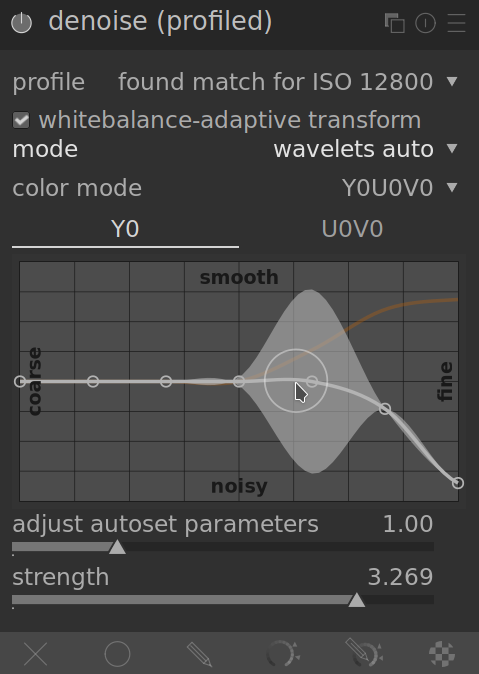
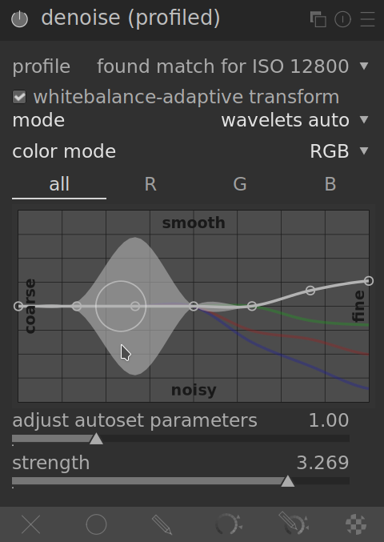

An easy to use and highly efficient denoise module, adapted to the noise profiles of specific camera sensors.

One issue with a lot of denoising algorithms is that they assume that the variance of the noise is independent of the luminosity of the signal. By profiling the noise characteristics of a camera's sensor at different ISO settings, the variance at different luminosities can be assessed, and the denoising algorithm can be adjusted to more evenly smooth out the noise.

Currently, darktable has sensor noise profiles for over 300 popular camera models from all the major manufacturers. If you generate your own noise profile for a camera that is not yet supported by darktable, be sure to share it with the darktable development team so they can include it in the next release! Please see darktable's [camera support](https://github.com/darktable-org/darktable/wiki/Camera-support) page for more information.

# modes

The _denoise (profiled)_ module implements two main algorithms, each of which is available in either an easy-to-use "auto" mode or a more advanced mode, with additional controls:

non-local means
: This algorithm works in the spatial domain in much the same way as the [_denoise (non-local means)_](./denoise-non-local-means.md) module. This algorithm averages each pixel with some surrounding pixels in the image. The weight of such a pixel in the averaging process depends on the similarity of its neighborhood with the neighborhood of the pixel being denoised. A patch with a defined size is used to measure that similarity. 

: Note that this algorithm is quite resource-intensive.

wavelets
: This algorithm works in the [wavelet](../../darkroom/interacting-with-modules/wavelets.md) domain, and provides a simplified user interface. Wavelet decomposition allows you to adjust the strength of the denoising depending on the coarseness of the noise in the image. This mode can be used in either _Y0U0V0 color mode_ (which allows you to independently control luminance and chroma noise) or _RGB color mode_ (which allows you to independently control noise for each RGB channel).

: The wavelet algorithm is less resource-intensive than _non-local means_.

## luma versus chroma noise

Both “non-local means” and “wavelet” algorithms can efficiently tackle luma (lightness) noise and chroma (color) noise.  

In the past, it was suggested that you should use two separate instances of the _denoise (profiled)_ module. The first instance would be used together with a color blending mode to tackle _chroma_ noise, and the second instance with a lightness blending mode to tackle _luma_ noise. 

This isn't really recommended any more, since the _denoise (profiled)_ module occurs early in the pixel pipe, before the input color profile (in order that the profile parameters are accurate) but color blending modes should really only be used after the input color profile has been applied.

The new algorithms in this module now provide their own methods of dealing separately with luma and chroma noise, and in both cases this can be handled within a single module instance.

# module controls

The _denoise (profiled)_ module provides a few controls that are independent of the algorithm used. These are described first, before moving on to the algorithm-specific controls. 

When describing the controls specific to an algorithm, we will first cover the simplified interface, and then move on to the more advanced controls for that algorithm.

Note that sliders are provided with minimum and maximum values by default. However these are only soft limits and, where needed, higher values can be entered by `right-clicking` on the slider and using the keyboard.

## common controls

profile
: darktable will automatically determine the camera model and ISO based on Exif data of your raw file. If found in its database, the corresponding noise profile will be used. If your image has an intermediate ISO value, the statistical properties will be interpolated between the two closest datasets in the database, and this interpolated setting will show up as the first line in the combo box. You can also manually override this selection if necessary. Re-selecting the top-most entry in the combo box will return you to the default profile.

mode
: Choose which denoising algorithm to use (see above), and whether to present the simplified ("auto") or full manual interface for that algorithm.

whitebalance-adaptive transform
: As white balance amplifies the RGB channels differently, each channel exhibits different noise levels. This checkbox makes the selected algorithm adapt to the white balance. This option should be disabled on the second instance if you have used a first instance with a color blend mode.

adjust autoset parameters (auto mode only)
: Automatically adjust all the other parameters on the current denoising algorithm using a single slider interface. This is particularly useful when you have had to increase the exposure on an under-exposed image, which normally introduces additional noise as if you had taken the shot with a higher ISO. This control compensates for that by using settings similar to what it would use for a higher ISO image. In general, the value of this slider indicates the number of stops by which you had to increase the exposure. For example, if you had to push the exposure 2 stops above what you normally use, then set this slider to `2`.

strength
: Fine-tune the strength of the denoising. The default value has been chosen to maximize the peak signal to noise ratio. It's mostly a matter of taste if you prefer a rather low noise level at the costs of a higher loss of detail, or if you accept more remaining noise in order to have finer structures better preserved within your image.

: In the case of _wavelets_ mode, the default value of this slider may not be sufficient. If you do not set a high enough strength, then adjusting the wavelet curves above it will not have a large enough effect. It is therefore recommended that you set a reasonably high strength on this slider, and than make finer adjustments on the wavelet curves. Don't hesitate to `right-click` and enter a higher value if the default soft limit for this slider doesn't allow for enough denoising. 

preserve shadows (advanced mode only)
: Choose whether to denoise the shadows more agressively. Lower the value to denoise the shadows more. Usually, as noise increases, you will need to lower this value.

bias correction (advanced mode only)
: Correct any color cast that may appear in the shadows. Increase this value if dark shadows appear too greenish, decrease it if they appear purple-ish.

## non-local means auto sliders

central pixel weight (details)
: Control the amount of detail that should be preserved by the denoising algorithm. By default, this will have a low value, meaning that the algorithm will treat both luma and chroma noise equally. Moving this slider to the right will reduce the amount of luma denoising, so that the denoising will primarily affect chroma noise. By adjusting this slider together with the _strength_ slider, you can find a good balance in the amount of luma versus chroma denoising.

## non-local means advanced sliders

When you take non-local means out of auto mode, the _adjust autoset parameters_ slider will be replaced by the following controls. You can use the auto-adjust slider to arrive at some initial settings then, when you switch to manual mode, the sliders will show the set of manual settings that are equivalent to that auto-adjust setting. You can then continue to fine-tune the manual settings using the initial auto setting as a starting point.

patch size
: Control the size of the patches being matched when deciding which pixels to average -- see [_denoise (non-local means)_](./denoise-non-local-means.md). Set this to higher values as the noise gets higher. Be aware that high values may smooth out small edges. The effect of this slider on processing time is minimal.

search radius
: Control how far away from a pixel the algorithm will try to find similar patches. Increasing the value can give better results for very noisy images when coarse grain noise is visible, but the processing time is hugely impacted by this parameter (the processing time is in the order of the square of this parameter). A lower value will make execution faster, a higher value will make it slower. It most cases it is better to use the scattering parameter, which has a similar effect but without the heavy processing cost.

scattering (coarse-grain noise)
: Like the _search radius_, this slider controls how far from a pixel the algorithm will try to find similar patches. However, it does this without increasing the number of patches considered. As such, processing time will stay about the same. Increasing the value will reduce coarse grain noise, but may smooth local contrast. This slider is particularly effective at reducing chroma noise.

## wavelet curves

These curves are only available if the “wavelet” mode is selected. The noise in an image usually consists of both fine grain and coarse grain noise, to varying degrees. These curves allow the strength of the denoising to be adjusted depending on the coarseness of the visible noise. The left end of the curve will act on very coarse grain noise, while the right of the curve will act on very fine grain noise. Pushing up the curve will increase the amount of smoothing, whereas pulling it down will decrease the amount of smoothing.

For example, you can preserve very-fine-grain noise by pulling the right-most part of the curve down towards the bottom. If you were tackling chroma noise (eg. on a U0V0 curve, or on a second module instance with a color blend mode) you could push the right side of the curve up towards the top, since colors are not supposed to change a lot on fine grain scales. This can be useful if you see some noisy isolated pixels with the wrong color.

## wavelets _Y0U0V0_ color mode

The preferred way to use wavelets is with the new _Y0U0V0 color mode_. This separates the denoising curves into luminance (_Y0_) and color (_U0V0_) components. You can then use the _Y0_ curve to control the level of luma denoising at different scales, and the _U0V0_ curve to control the level of chroma denoising at different scales.

## wavelets _RGB_ color mode

Before the _Y0U0V0 color mode_, wavelet-based denoising could only be performed directly on the _R_, _G_ and _B_ channels, either all together in one go, or on an individual channel basis.

If you want to denoise the channels separately, the best way to do this is to use an instance of the [_channel mixer_](channel-mixer.md) module immediately before the _denoise (profiled)_ module so that it outputs a grey channel based on the _red_ channel only, then denoise that monochrome image using the _red_ wavelet curve. Repeat this procedure for the blue and green channels. This procedure is time-consuming, but gives the best result because looking at the color of a noisy pixel is not a reliable way to determine which channel to adjust (e.g. a noisy red pixel could be due to a noise peak on the red channel, but could also be due to a noise lull on the blue and green channels).

The issue with denoising the _RGB_ channels individually like this is that there can still be some residual chroma noise at the end that requires excessive smoothing to eliminate. This was in fact one of the key motivations behind implementing the _Y0U0V0 color mode_.

## wavelets advanced sliders

When you take _wavelets_ out of _auto_ mode, the _adjust autoset parameters_ slider will be replaced by the _preserve shadows_ and _bias correction_ controls listed above in the _common controls_ section.

