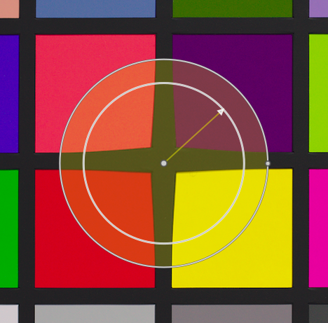
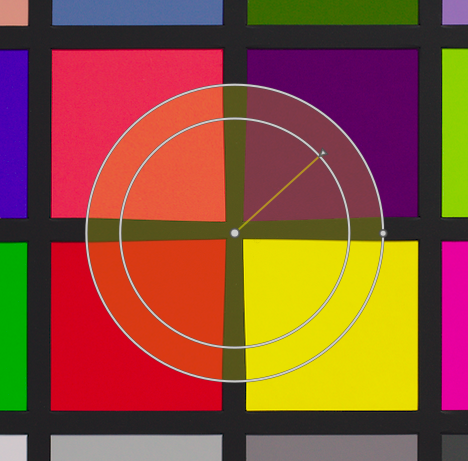
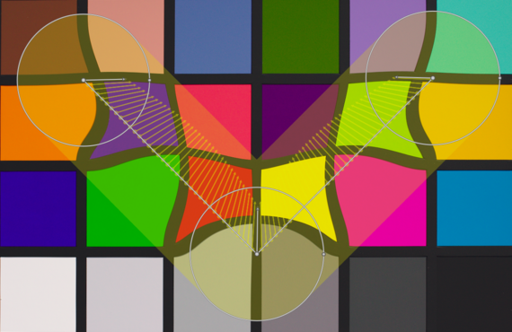
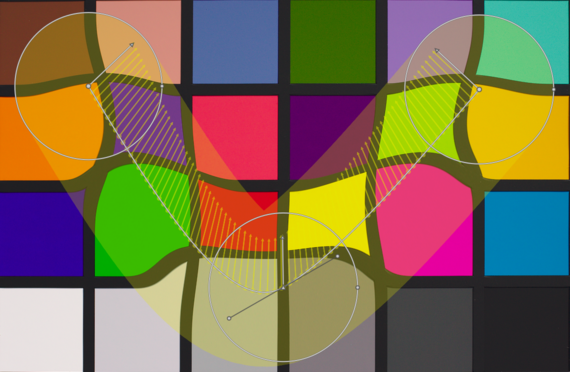

Move pixels around by applying freestyle distortions to parts of the image using points, lines and curves.

# nodes

 Each of liquify's tools is based on nodes. A point is given by a single node and a line or curve consists of a set of nodes defining a path.

There is a limit of 100 nodes in a single liquify instance. For more nodes than this, use additional module instances. However, note that the liquify module consumes a lot of system resources. 

Drag the central point of a node to move the node around. The radius describes the area of the applied effect (the distortion occurs only inside this radius). To change the radius drag the handle at the circumference. A strength vector starting from the center describes the direction of the distortion, and its strength is depicted by the length of the vector. Change the vector by dragging its arrowhead. 

# points

Click the point icon to activate the point tool and click on the image to place it. Holding Ctrl while clicking on the point icon allows you to add multiple points without having to click the icon again. Right-click to exit creation mode.

A point is formed by a single node. In a point the strength vector has three different modes which are toggled using Ctrl+click over the arrowhead of the strength vector.

## point modes

linear
: A linear distortion inside the circle, starting from the opposite side of the strength vector and following the vector's direction. This is the default mode.

: 

radial growing
: The strength vector's effect is radial, starting with a strength of 0% in the center and increasing away from the center. This mode is depicted by an additional circle with the arrow pointing outwards.

: 

radial shrinking
: The strength vector's effect is radial, starting with a strength of 100% in the center and decreasing away from the center. This mode is depicted by an additional circle with the arrow pointing inwards.

: 

## feathering

default mode
: By default the strength varies linearly from 0% to 100% between the center and the radius of the control point. It is possible to modify the feathering effect by clicking on the center of the circle.

: 

feathered mode
: In "feathered" mode, two control circles are displayed and can be modified independently to feather the strength of the effect. Note that clicking the center of the circle again hides the feathering controls but does _not_ return to the default mode.

: 

## removing points

A point can be removed by right-clicking on the center of the node.

# lines and curves

Lines and curves are sets of points linked together by straight or curved lines. The effect is interpolated by a set of strength vectors. 

Click the appropriate icon to activate the line or curve tool and click on the image to place points to form the path. Right-click anywhere when the last point has been placed in order to finish drawing a line/curve.

Holding Ctrl while clicking on the point icon allows you to add multiple points without having to click the icon again. Right-click a second time to exit creation mode after a line or curve has been completed.

lines
: 

curves
: 

Ctrl+click on a line or curve segment to add a new control point. Ctrl+right-click on the center of a node to remove a control point. 

Right-click on a segment to remove the shape completely. Ctrl+Alt+click on a segment to change that segment from a line to a curve and vice versa.

# link modes

Ctrl+click on the center of a node to change the way the points of a curve are linked together. There are four modes which correspond to different ways of handling the steepness of the bezier curve using control handles: 

autosmooth
: This is the default mode, in which control handles are not displayed as they are automatically computed to give a smooth curve.

cusp
: Control handles can be moved independently. This mode is depicted by a triangle symbol in the node center.

smooth
: Control handles always give a smooth curve. This mode is depicted by a diamond symbol in the node center.

symmetrical
: Control handles are always moved together. This mode is depicted by a square symbol in the node center.

# view and edit nodes

Click the node tool icon to activate or deactivate the node edit tool displaying all defined distortion objects and their controls. Alternatively you can at any time right-click on the image for the same effect. 

# warps and nodes count

This information field displays the number of warps (individual distortion objects) and nodes currently used.

