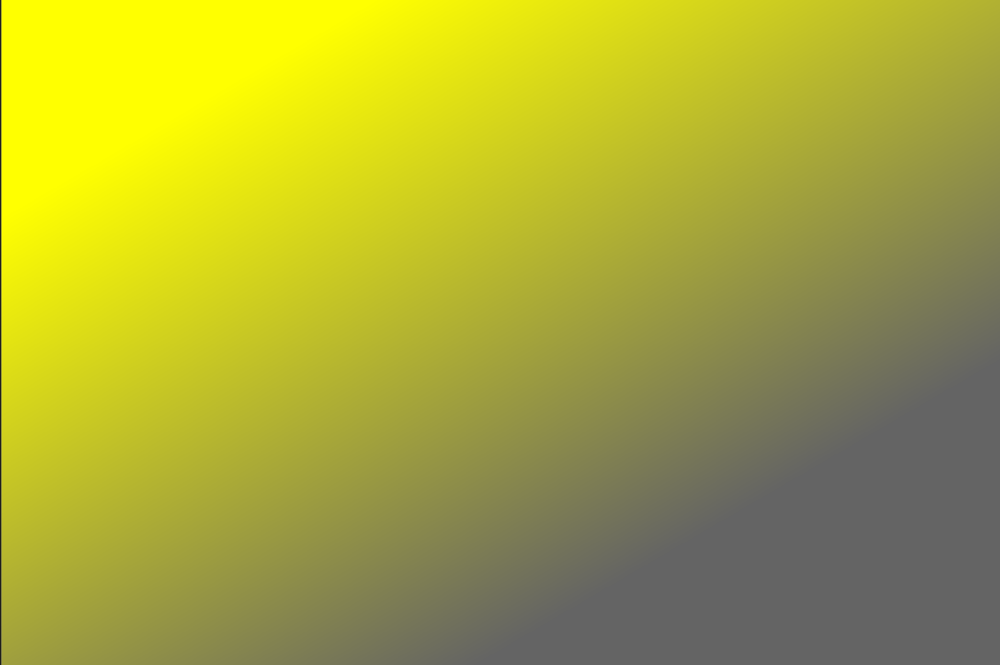
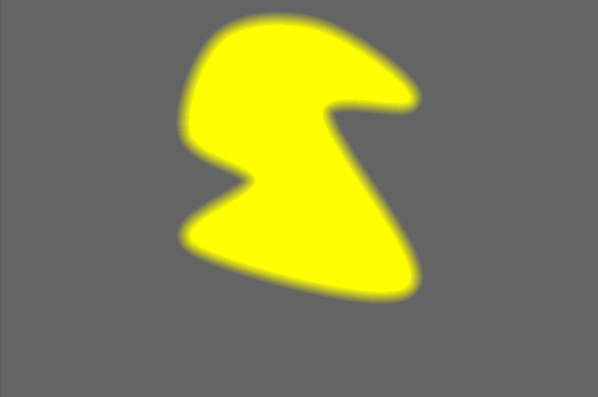
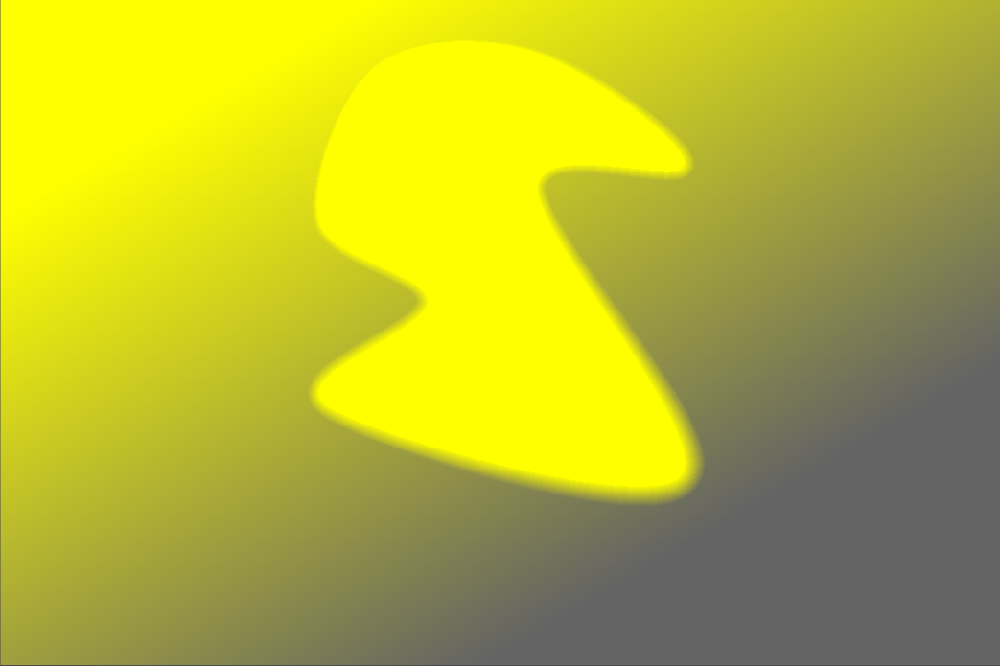
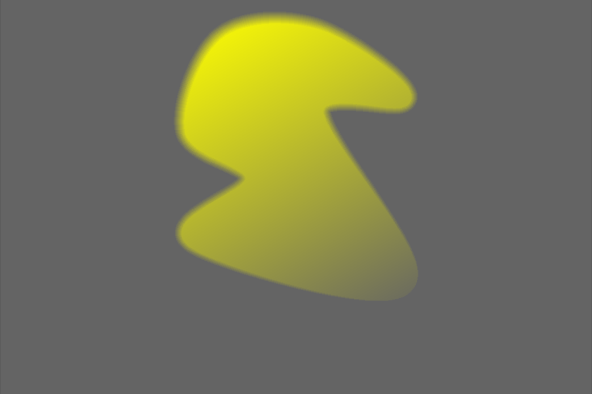
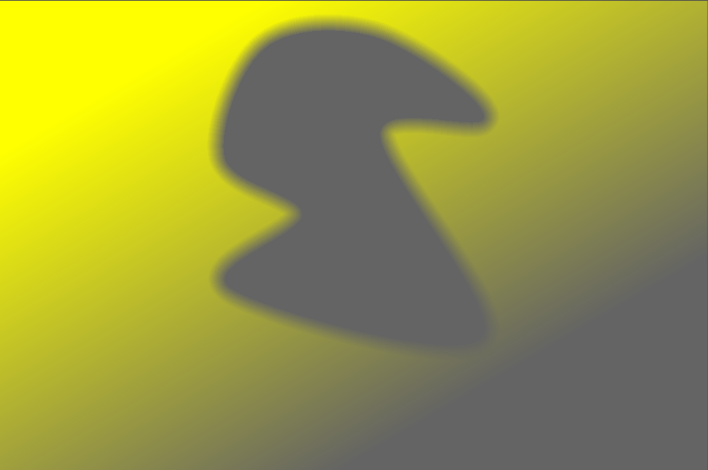
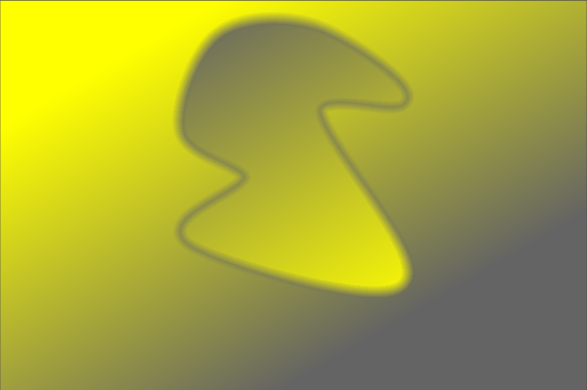

Manage all masks and shapes for the current image. 

This module can be used to create, rename, edit and delete shapes. You can add shapes to and remove shapes from a mask, group shapes together, and combine them using set operators. 

In the top line of the mask manager panel are buttons that can be used to create new shapes. These are the same as in the [drawn mask](../../../darkroom/masking-and-blending/masks/drawn.md) interface of the individual modules.

The panel below these buttons displays a list of all masks and individual shapes defined for the current image. 

Groups of shapes forming a mask are displayed with a headline in the form `grp <module_name>` indicating the module in which they are used, with the component shapes listed below. The list of mask groups is followed by a list of all individual shapes that have been generated in the context of the current image. If a shape is in use by any masks this is indicated by a symbol to the right of the shape name. 

# shapes

By default each shape receives an automatically generated name, consisting of the shape type (“brush”, “circle”, “ellipse”, “path”, “gradient”) and an automatically-incremented integer. You can rename a shape by double-clicking on its current name. It is a good habit to give shapes and groups meaninful names, especially if you are going to use the same selection in different masks.

Click on a shape name to show the selected shape on the image canvas with all of its controls, allowing you to edit the properties of just that shape. This is especially useful where there are many overlapping shapes within a mask, making it difficult to select the right one with the mouse.

Right-click on a shape name to show a menu with options to remove the current shape or to remove all shapes not currently in use.

_Note: darktable retains all shapes that have ever been defined for the current image unless you explicitly remove them. If you choose to include develop history when exporting an image, all defined shapes will be exported with the image. Beware that if the list of shapes is very long the space required to store those shapes might exceed the size limit of certain file formats. This can cause XMP tag creation to fail during export._

# masks

Masks are constructed by adding shapes in the order that they are listed from top to bottom. Each shape adjusts the existing mask using one of four logical set operators (see below). Because order is important it is also possible to move shapes up and down the list.

Click on the name of a mask to expand the list of the individual shapes which constitute that mask.

Right-click on the mask name to show a menu which with options to add new or existing shapes to the mask, or to clean up unused shapes.

Right-click on any of the constituent shapes to control how that shape contributes to the mask:

remove from group
: Remove the shape from the current mask

use inverted shape
: Invert the polarity of the selected shape

mode\: (union, intersection, difference, exclusion)
: Choose how this shape will interact with the preceding mask by selecting one of the four set operators defined below

move up/down
: Move the shape up or down the list

# set operators

**NEEDS EXAMPLE IMAGES**

As an example we will use a mask that combines a gradient followed by a path, to demonstrate the effect of each set operator when applied to the path shape. As a convention we say that a pixel is “selected” in a mask or shape if it has a value higher than zero. 

 

union
: This is the default set operator. It is depicted by the symbol  to the left of the shape name. The shape adds to the existing mask in such a way that the resulting mask contains the pixels that are *either* selected in the existing mask *or* in the added shape. In overlapping areas the maximum value is taken. 

intersection
: This set operator is depicted by the symbol  to the left of the shape name. The shape adds to the existing mask in such a way that the resulting mask contains only pixels that are selected in *both* the existing mask *and* the added shape. In overlapping areas the minimum value is used. In the given example we use this operator to “imprint” the path with a gradient. 

difference
: This set operator is depicted by the symbol  to the left of the shape name. In the non-overlapping area the existing mask is unchanged. In the resulting mask, pixels are selected only if they are selected in the existing mask but *not* in the added shape. This set operator can be chosen if you want to “cut out” a region from within an existing selection. 

exclusion
: This set operator is depicted by the symbol  to the left of the shape name. The resulting mask has all pixels selected that are either selected in the existing mask and not in the added shape or vice versa. This is equivalent to an “exclusive or”. 

