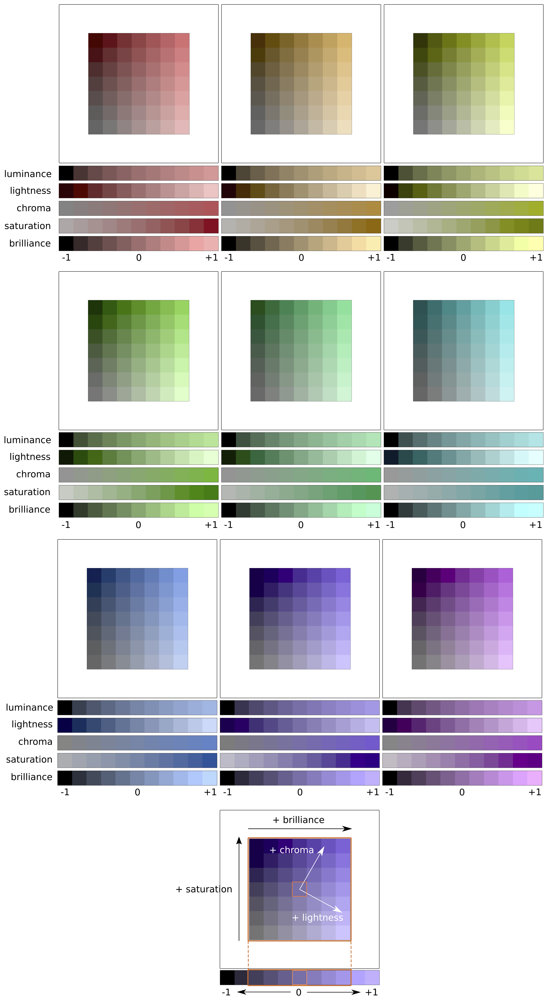
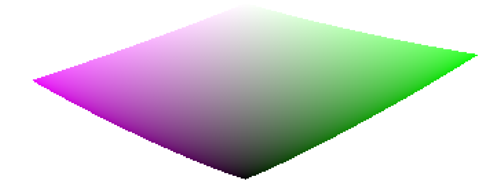
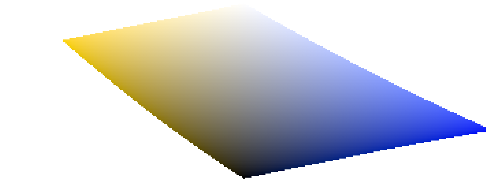
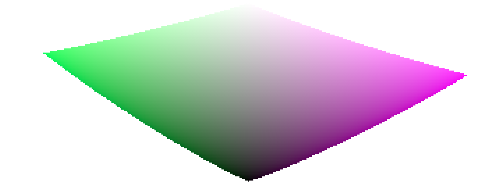

For communication purposes, it is important to define the perceptual properties of color, both conceptually and quantitatively, in order to characterize and quantify the creative and corrective adjustments made on color in the software.

Color properties like "saturation", "brightness" or "lightness" have passed to common language but are largely misused and permuted. In color science, each of these terms has a precise meaning.

# Definitions

There are two frameworks in which color properties can be analyzed and described:

* a scene-linear, physiological, framework, that will mostly focus on the retina cone cells response, using color spaces such as CIE XYZ 1931 or CIE LMS 2006,
* a perceptual, psychological, framework that will stack the brain correction on top of the retina signal, using color spaces such as CIE Lab 1976, CIE Luv 1976, CIE CAM 2016 and JzAzBz (2017).

These two frameworks give us metrics and dimensions to analyze color and change some of its properties while preserving others unchanged. darktable uses 7 dimensions of colors:

hue
: attribute of a visual perception according to which an area appears to be similar to one of the colours red, yellow, green, and blue, or to a combination of adjacent pairs of these colours considered in a closed ring. [^1] Hue is a shared property between perceptual and scene-linear frameworks.

luminance
: density of luminous intensity with respect to projected area in a specified direction at a specified point on a real or imaginary surface. [^2] Luminance is a property of scene-referred frameworks, and is expressed by the Y channel of the CIE XYZ 1931 space.

brightness
: attribute of a visual perception according to which an area appears to emit, transmit or reflect, more or less light. [^4]

lightness
: brightness of an area judged relative to the brightness of a similarly illuminated area that appears to be white or highly transmitting. [^3] Lightness is the perceptual, non-linear, homologue of luminance (lightness is roughly equal to the cubic root of luminance Y). Lightness is expressed by the L channel in CIE Lab and Luv 1976 and the J channel in JzAzBz.

chroma
: colourfulness of an area judged as a proportion of the brightness of a similarly illuminated area that appears grey, white or highly transmitting. [^5] Warning: chroma is not short for chrominance, chrominance is the color part of a video signal (in YCbCr, for example, that would be the Cb and Cr channels).

brilliance
: brightness of an area judged relative to brightness of the surround. [^6]

saturation
: colourfulness of an area judged in proportion to its brightness. [^7]

[^1]: <https://cie.co.at/eilvterm/17-22-067>
[^2]: <https://cie.co.at/eilvterm/17-21-050>
[^3]: <https://cie.co.at/eilvterm/17-22-063>
[^4]: <https://cie.co.at/eilvterm/17-22-059>
[^5]: <https://cie.co.at/eilvterm/17-22-074>
[^6]: <https://doi.org/10.1002/col.20128>
[^7]: <https://cie.co.at/eilvterm/17-22-073>

Colors can be described in many different spaces, but no matter the space, they will need at least 3 components: some metric of luminance or brightness, and 2 metrics of chromaticity (hue and chroma, or opponent color coordinates).

# Illustrations

While the previous definitions are useful to put a meaning on the words, they don't tell us what we should be looking at. The following graph makes luminance, lightness, chroma, brilliance/brightness and saturation vary from a "0" base color and shows how the resulting colors degrade:

Lightness + Chroma or Brilliance/Brightness + Saturation are two different ways to encode the same reality. They are both orthogonal spaces that can be converted from one to another by a simple rotation of the base. This means chroma evolves at constant lightness and saturation evolves at constant brilliance/brightness, and the other way around:

The lines of equal chroma are vertical (following the patches grid), meaning that chroma has the same direction for all colors on the gamut. However, the lines of equal saturation are oblique (drawn dashed on the graph) and all go from black though each color patch, meaning their direction is particular to each color.

Increasing chroma will therefore move all colors uniformingly away from the central grey axis, over the horizontal direction, while increasing saturation will close or open the angle of the oblique dashed lines like a flower.

Similarly, increasing lightness will move all colors uniformingly away from the horizontal axis to the top, while increasing brilliance/brightness will move them along the lines of equal saturation.

On both graphs above, lightness, chroma, saturation and brilliance are drawn in JzAzBz, which is a perceptual color space suited for HDR signal, used in parametric masks and in color balance RGB. Luminance is drawn in CIE XYZ 1931, and represents the effect of an exposure compensation. It shows the same behaviour as brilliance, except the step size is not perceptuall scaled.

---

**Note**: In this section, *brilliance* and *brightness* are used simultaneously to describe the same dimension. In all rigor, brightness is an absolute metric, while brilliance is the brigtness of some surface relative to its surround brightness (that is, how much a surface "pops" out of its surround and looks fluorescent). But in image editing, increasing the brightness of some surface will indeed increase its brilliance too, so the term *brilliance* has been prefered in darktable's GUI for clarity and in reference to its visual effect as a setting.

---

# Color dimensions and gamut

The gamut is the volume of colors that a certain color space can encompass and encode. It is important to note that, once converted to perceptual spaces, the gamut of any RGB space is not uniform along hues.

The following examples show the gamut volume of the sRGB space on hue slices containing the primary red, green and blue lights of the sRGB space, over a lightness-chroma plane with an uniform scale:

This shows that increasing the chroma (displacement over the horizontal axis) of some quantity can be safe for some hues at some lightness, but can push other hue-lightness coordinates way out of gamut. For example, we have much more margin in green or magenta than in cyan.

Many gamut issues, at exporting time, are actually user-induced and result of harsh chroma enlarging. For that reason, using brightness-saturation color models may be safer.

# Color dimensions and complementary colors

Cyan, magenta, yellow are complementary colors of red, green, blue. However, the complementary CMY spaces computed from RGB spaces are not perceptualy complementar. To show it, we create a CMY space from sRGB, where cyan has sRGB coordinates (0, 1, 1), magenta (1, 0, 1) and yellow (1, 1, 0), and display it in a lightness-chroma space:

By comparing to the hue slices of the primary colors, in the previous section, it is easy to see that not only the gamuts don't have the same shapes, but the colors don't match.

This is one more argument to avoid using HSL/HSV spaces that are derivated from RGB spaces to perform color editing, since these RGB spaces are not perceptually uniform in the first place, the resulting HSV/HSL spaces are not either. While RGB spaces have some merit based on their connection to physical light, any process involving hue should go directly to perceptual spaces.

# Color dimensions and settings

Many pieces of software, including darktable, call "saturation" settings that actually affect chroma (for example: in color balance, contrast/brightness/saturation, basic adjustments, etc.). This is a symptom of software trying to be accessible to non-professionals by using common language, however it is misleading since saturation does exist and is quite different from chroma. Also, many video specifications improperly call chroma "saturation", so whenever darktable reuses such specifications, it uses the incorrect name from the specification rather than the proper color dimension name.
